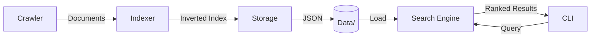

# Quote Search Engine

A modular Python CLI search engine for quotes from [quotes.toscrape.com](http://quotes.toscrape.com/). This project implements a web crawler, an inverted indexer, and a ranked search engine.

## Project Overview

This project is a CLI-based search engine designed to scrape quotes from a specific website, build a searchable inverted index with TF-IDF ranking, and provide an interface for querying quotes via intersection and exact phrase searches.

The coursework objective is to demonstrate a complete information retrieval pipeline:

```text
crawl -> clean/tokenize -> index -> persist -> load -> search
```

### System Architecture



The crawler uses a default **6-second politeness delay** between page requests. This keeps the tool respectful of the target website during a real build while still allowing shorter delays in tests or demonstrations with `--delay`.

The system is composed of several modules:
- **Crawler**: Scrapes quotes from the website with a polite delay and retry logic.
- **Indexer**: Processes the text into an inverted index with term frequency (TF) and inverse document frequency (IDF) for ranking.
- **Storage**: Manages saving and loading the built index to/from the `data/` directory.
- **Search Engine**: Handles user queries, supports simple multiple word queries and exact phrase queries, returning ranked results.

## Key Features

- **Politeness First**: Built-in 6-second delay between requests to ensure respectful scraping.
- **Robust Parsing**: Handles various HTML structures and skips duplicate content.
- **Accurate Ranking**: Uses TF-IDF for relevant search results.
- **Positional Indexing**: Enables efficient exact phrase matching.
- **Comprehensive Testing**: 96% code coverage with mocked network calls.

## Architecture and Design Rationale

The project follows a modular architecture to ensure separation of concerns:
- **Modular Design**: Each core component (Crawler, Indexer, etc.) is isolated in its own file, making the system easy to maintain and test.
- **Inverted Index with Positional Tracking**: Instead of a simple term-to-doc mapping, the indexer tracks the exact position of each token in each document. This allows the search engine to support complex phrase queries at high speed.
- **TF-IDF Ranking**: Results are ranked using the Term Frequency-Inverse Document Frequency algorithm, ensuring that the most relevant and "unique" matches appear at the top of the search results.
- **JSON Storage**: The index is persisted as a structured JSON file, allowing for easy inspection and fast loading without needing a database server.

## Dependencies and Installation

### Prerequisites
- Python 3.8+
- [Optional] Virtual environment (recommended)

### Dependencies
The project uses the following libraries:
- `requests`: To fetch web pages.
- `beautifulsoup4`: To parse HTML content.
- `pytest`, `pytest-cov`, `requests-mock`, `pytest-mock`: For testing and coverage.

### Installation Steps

1. **Clone the repository**:
   ```bash
   git clone https://github.com/Sachin-1712/web-cwk2-search-engine.git
   cd web-cwk2-search-engine
   ```

2. **Set up a virtual environment (optional)**:
   ```bash
   python -m venv venv
   source venv/bin/activate  # On Windows, use `venv\Scripts\activate`
   ```

3. **Install dependencies**:
   ```bash
   pip install -r requirements.txt
   ```

## Usage Examples

The tool is a **CLI-based application** using the `argparse` subcommand pattern. It is **not** an interactive shell; you run specific commands from your terminal.

### 1. Build the Index (`build`)
Crawls the website, builds the index, and saves it to `data/index.json`.

**Note**: The default command uses the coursework politeness delay of **6 seconds** between requests.

```bash
# Build with default parameters (6s delay)
python -m src.main build

# Build with a specific limit for testing (faster execution)
python -m src.main build --max-pages 2 --delay 1.0
```

### 2. Load the Index (`load`)
Loads the saved index into memory to verify it's valid.

```bash
python -m src.main load
```

### 3. Print Index Statistics (`print`)
Displays statistics or looks up a specific word.

```bash
# Print general statistics
python -m src.main print

# Print details for a specific word
python -m src.main print love
```

### 4. Find Quotes (`find`)
Search for quotes using multi-word intersection or exact phrase match.

```bash
# Multi-word intersection query (matches documents containing ALL words)
python -m src.main find life success

# Exact phrase query (wrap the phrase in double quotes within the shell argument)
python -m src.main find '"to be or not to be"'
```

## Demo Commands

These commands provide a concise walkthrough for the coursework video:

```bash
python -m src.main build --max-pages 2 --delay 1.0
python -m src.main load
python -m src.main print love
python -m src.main find life success
python -m src.main find '"good friends"'
```

For the final real crawl, run `python -m src.main build` so the full 6-second politeness delay is applied.

## Testing Instructions

The project uses `pytest` for unit testing with coverage tracking.

### Run all tests
```bash
python -m pytest -v
```

### Run tests with coverage report
```bash
python -m pytest --cov=src --cov-report=term-missing
```

The test suite covers:
- Crawling logic with mocked responses.
- Indexing and TF-IDF calculation accuracy.
- Search result ranking and phrase matching.
- JSON storage persistence.
- CLI argument parsing and error handling.

## Edge Case Behaviour

- **Unknown words**: `print` and `find` return a friendly `[INFO]` message instead of crashing.
- **Empty queries**: Search input is validated before any lookup is attempted.
- **Network failures**: The crawler retries transient request failures with exponential backoff before giving up cleanly.
- **Duplicate quotes**: Repeated quote text is ignored so the index does not count the same content twice.
- **Missing index file**: Load/search commands report that the index must be built first.

## Repository Structure

- `src/`: Core source code module.
  - `crawler.py`: Web scraping and politeness logic.
  - `indexer.py`: Tokenization and inverted index management.
  - `search.py`: Ranking logic and query processing.
  - `storage.py`: JSON persistence for the index.
  - `main.py`: CLI entry point and orchestration.
- `tests/`: Comprehensive test suite.
- `data/`: Auto-generated directory containing the persisted `index.json`.
- `requirements.txt`: List of Python dependencies.
- `README.md`: This documentation.
